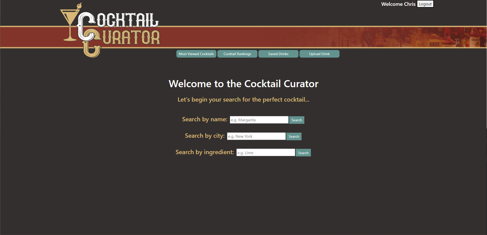
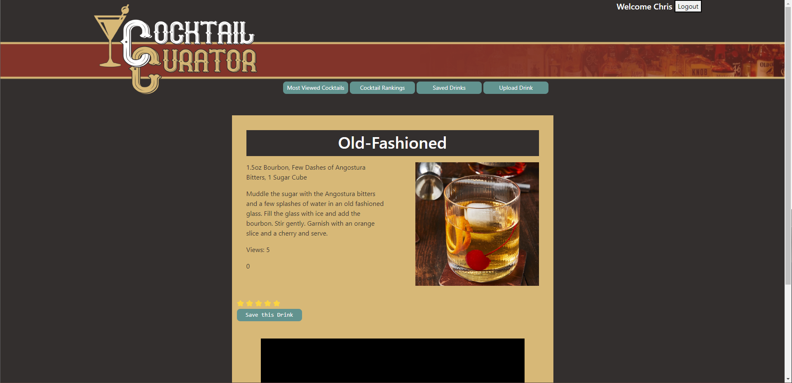
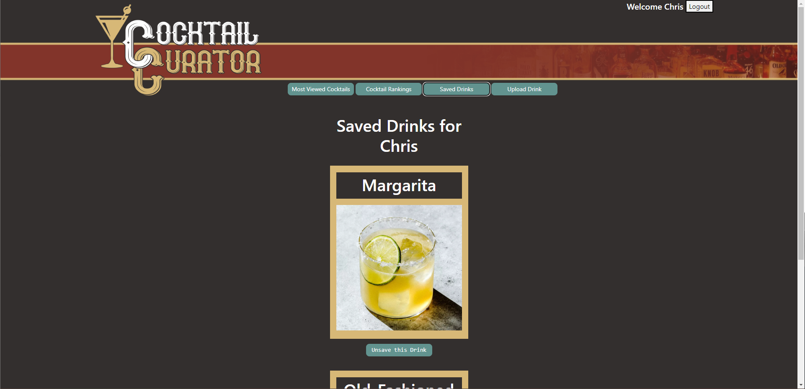
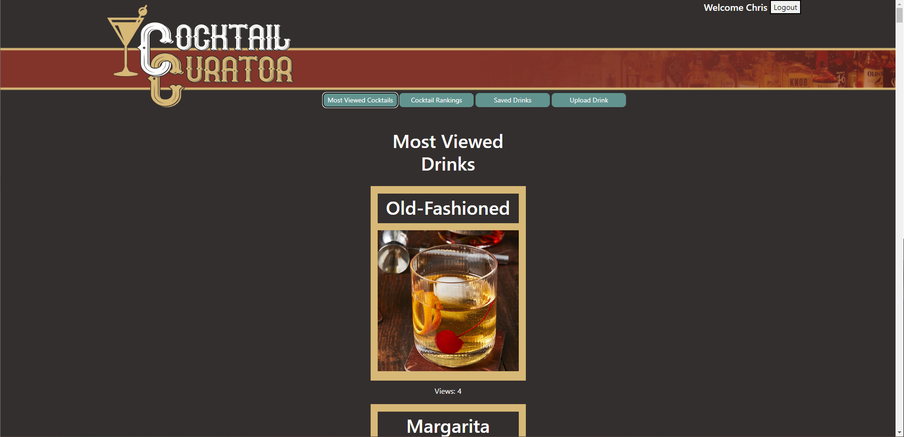
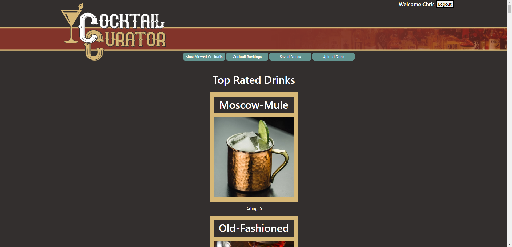
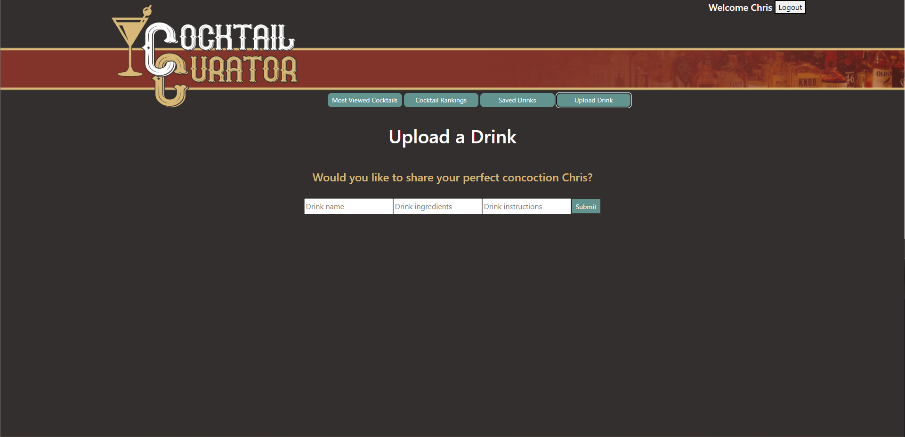

# The-Cocktail-Curator

Welcome to The Cocktail Curator! We've created a page to offer recommendations based on the temperature of the city you're searching, as well as the option to search by ingredient and name to see all the possible choices out there! There is also an option to save those drinks to a list associated to your account for you to refer to later for when the opportunity arises. The ability to see the most viewed drinks, ranking and the ability to upload your own drinks. Once you go and find the drink you're after you're able to also watch a video on how you'd be able to make it just below!.

Here is our deployed site on heroku! https://the--cocktail--curator.herokuapp.com/

## Home
Here is an example of the home screen. You are met with a welcome screen and options to search by the name of the drink, your cities weather as well as ingredient.

## Logged in & Search feature
After logging in you're greeted by the site. Here also is a search giving back the drinks information, ingredients and instructions.

## Card Example
You can then click on the card of a drink you're interested in and see more options, to save a drink to your own saved drinks list, give it a rating based on how you've enjoyed it and be given a video on how to create the drink below.

## Saved Drinks
Heres an example of the drinks you've saved to your list, they'll be displayed in a list for you to go back to.

## Most Viewed
Heres an example of the most viewed drinks.

## Top Rated
The rankings of drinks shown in order of the best.

## Upload Drinks
The upload drink page offers the option to add a name, its ingredients and the instructions on how to make said cocktail.

